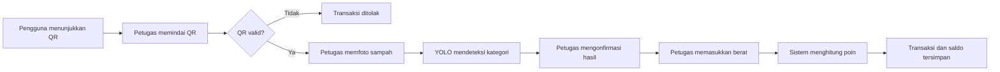
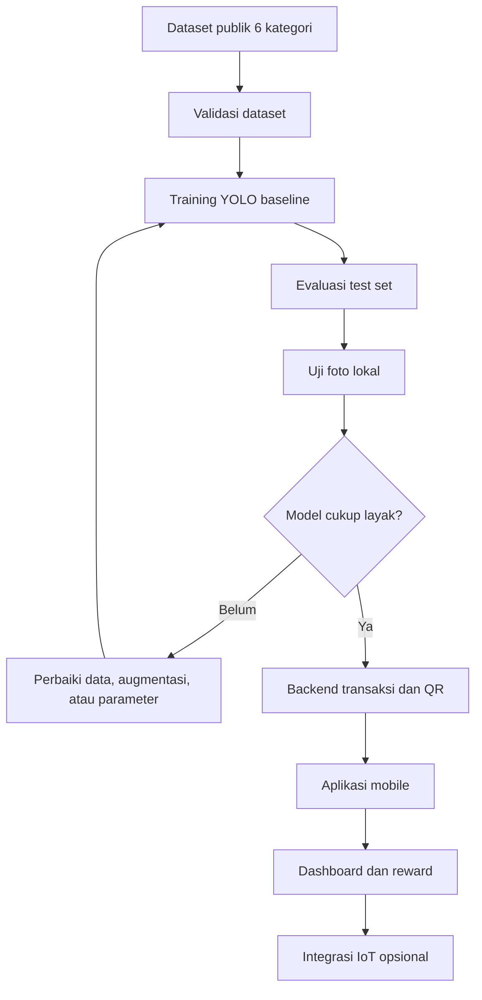

# Workflow EcoTrack

## Alur pengguna dan transaksi

YOLO bertindak sebagai pemberi rekomendasi. Petugas tetap dapat mengoreksi kategori sebelum transaksi disimpan.

## Alur pengembangan

## Ruang lingkup MVP

- Login dan peran pengguna, petugas, serta admin.
- QR unik untuk identitas pengguna.
- Deteksi enam kategori sampah menggunakan YOLO.
- Konfirmasi kategori dan input berat oleh petugas.
- Perhitungan poin dan riwayat transaksi.
- Dashboard ringkas untuk admin.

## Enam kategori awal

- Biodegradable
- Cardboard
- Glass
- Metal
- Paper
- Plastic

Urutan ID kelas wajib mengikuti `data.yaml` asli dari dataset.

