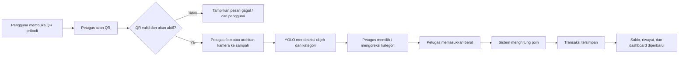
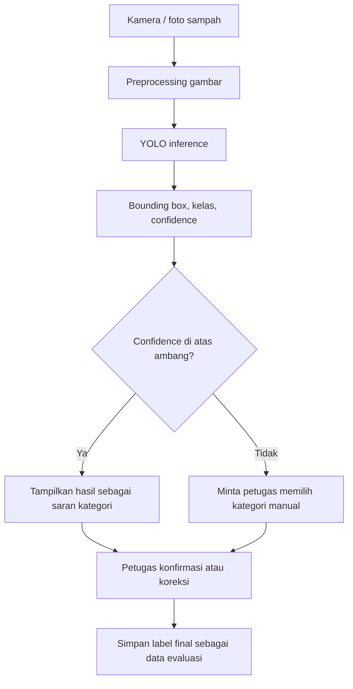
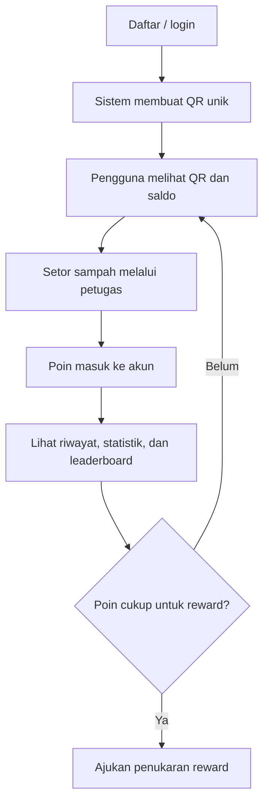
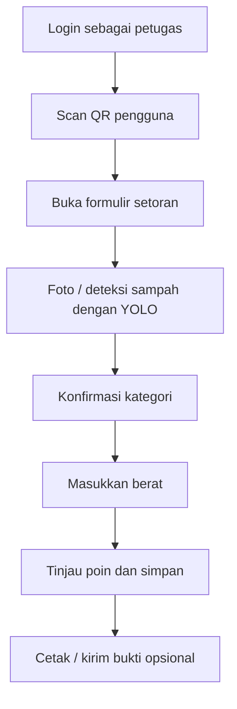
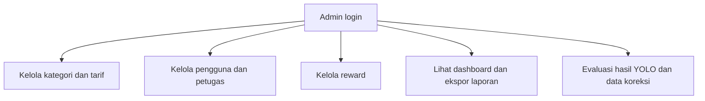
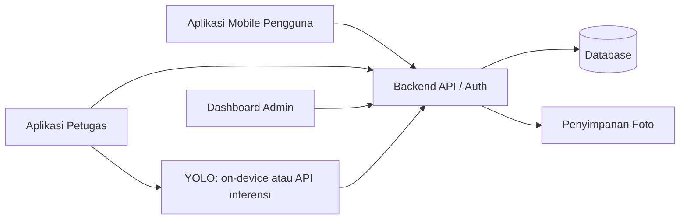
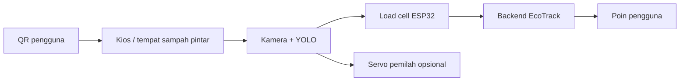

# EcoTrack — Workflow Proyek

## 1. Ringkasan

**EcoTrack** adalah aplikasi bank sampah digital berbasis QR Code dan *computer vision*. Sistem mencatat setoran sampah per pengguna, memakai YOLO untuk mendeteksi jenis sampah dari kamera, menghitung poin berdasarkan kategori dan berat, serta menyediakan dashboard operasional untuk petugas dan admin.

Tujuan versi awal adalah membuat proses setoran lebih cepat, terdokumentasi, dan menarik bagi pengguna. Keputusan akhir kategori serta berat tetap dapat diverifikasi petugas.

## 2. Aktor Sistem

| Aktor | Peran utama |
|---|---|
| Pengguna / nasabah | Memiliki QR pribadi, melihat poin, riwayat, statistik, dan reward. |
| Petugas | Memindai QR pengguna, memproses setoran, memverifikasi hasil YOLO, dan memasukkan berat. |
| Admin | Mengelola kategori, tarif poin, pengguna, petugas, reward, serta laporan. |
| Sistem ML (YOLO) | Mendeteksi objek sampah dan mengembalikan kategori, lokasi objek, dan confidence. |

## 3. Ruang Lingkup MVP

1. Registrasi, login, dan peran pengguna/petugas/admin.
2. QR Code unik untuk setiap pengguna.
3. Pemindaian QR oleh petugas.
4. Foto atau kamera untuk deteksi sampah menggunakan YOLO.
5. Konfirmasi kategori sampah dan input berat.
6. Perhitungan poin otomatis.
7. Riwayat setoran dan saldo/poin pengguna.
8. Dashboard admin dan laporan dasar.

Di MVP, berat sampah dimasukkan manual oleh petugas. Fitur timbangan otomatis dan pemilahan fisik adalah pengembangan tahap lanjut.

## 4. Kategori Sampah Awal

Gunakan jumlah kelas yang terbatas agar dataset dan model lebih terkontrol:

- Plastik
- Kertas
- Kardus
- Kaca
- Logam / kaleng
- Organik

Kategori dapat dikembangkan setelah evaluasi, misalnya organik, botol PET, sachet, e-waste, dan minyak jelantah.

## 5. Alur Utama Setoran Sampah



### Detail langkah

1. Pengguna menunjukkan QR pribadi dari aplikasi, kartu, atau cetakan QR.
2. Petugas memindai QR untuk mengambil identitas pengguna.
3. Sistem memvalidasi QR, status akun, dan memastikan QR tidak kedaluwarsa bila menggunakan QR dinamis.
4. Petugas mengambil foto sampah atau memakai *live camera*.
5. YOLO mengembalikan satu atau beberapa hasil deteksi, contoh: `plastic_bottle (0.94)`, `metal_can (0.88)`.
6. Petugas memilih objek yang diproses, mengubah kategori jika diperlukan, dan menentukan jumlah/beratnya.
7. Sistem menerapkan tarif poin sesuai kategori dan berat.
8. Sistem menyimpan transaksi secara atomik: transaksi, detail item, perubahan saldo, dan audit log.
9. Pengguna menerima notifikasi atau melihat saldo baru di aplikasi.

## 6. Aturan Perhitungan Poin

Rumus dasar:

```text
poin_item = berat_kg × tarif_poin_per_kg[kategori]
poin_transaksi = jumlah seluruh poin_item
```

Contoh tarif:

| Kategori | Tarif | Setoran | Poin |
|---|---:|---:|---:|
| Plastik | 20 poin/kg | 0,5 kg | 10 poin |
| Kardus | 10 poin/kg | 1,2 kg | 12 poin |
| Logam | 30 poin/kg | 0,3 kg | 9 poin |

Tarif perlu dikelola admin agar dapat mengikuti kebijakan bank sampah. Simpan tarif yang berlaku saat transaksi dibuat agar riwayat lama tidak berubah ketika tarif baru ditetapkan.

## 7. Workflow YOLO



### Prinsip penggunaan model

- YOLO memberi **rekomendasi**, bukan keputusan final transaksi.
- Tetapkan *confidence threshold*, misalnya 0,60. Hasil di bawah ambang harus dikonfirmasi manual.
- Simpan hasil prediksi awal dan kategori final dari petugas. Data koreksi berguna untuk evaluasi dan *retraining*.
- Untuk MVP, gunakan kondisi foto yang terkontrol: objek tampak jelas, pencahayaan cukup, dan sampah tidak terlalu menumpuk.

## 8. Workflow Pengguna



Fitur pengguna:

- QR identitas (statis atau dinamis).
- Saldo/poin dan total berat sampah yang pernah disetor.
- Riwayat transaksi per tanggal dan kategori.
- Statistik dampak sederhana, misalnya total kilogram plastik yang dialihkan dari residu.
- Katalog dan status penukaran reward.

## 9. Workflow Petugas



Petugas perlu dapat membatalkan transaksi yang belum selesai, tetapi transaksi tersimpan tidak boleh dihapus tanpa jejak. Jika ada koreksi, gunakan status pembatalan atau transaksi penyesuaian dan simpan alasan serta pelakunya.

## 10. Workflow Admin



Dashboard minimum:

- Total berat sampah per hari, minggu, dan bulan.
- Total berat per kategori.
- Jumlah transaksi dan pengguna aktif.
- Poin yang diterbitkan serta reward yang ditukar.
- Daftar hasil prediksi YOLO yang sering dikoreksi petugas.

## 11. Struktur Data Minimum

| Entitas | Data utama |
|---|---|
| `users` | id, nama, email/nomor, role, status, total_poin |
| `qr_tokens` | id, user_id, token, expired_at, status |
| `waste_categories` | id, nama, tarif_poin_per_kg, aktif |
| `transactions` | id, user_id, officer_id, waktu, total_berat, total_poin, status |
| `transaction_items` | id, transaction_id, category_id, berat, poin, foto_url |
| `ml_predictions` | id, item_id, model_version, kelas_prediksi, confidence, bounding_box, kelas_final |
| `rewards` | id, nama, biaya_poin, stok, aktif |
| `reward_redemptions` | id, user_id, reward_id, poin_dipakai, status, waktu |
| `audit_logs` | id, actor_id, aksi, entity, entity_id, waktu, detail |

## 12. Arsitektur Aplikasi yang Disarankan



Pilihan implementasi:

- **Mobile:** Flutter untuk aplikasi pengguna dan petugas.
- **Backend/data:** Supabase/Firebase untuk MVP, atau FastAPI + PostgreSQL untuk kontrol lebih penuh.
- **Model:** YOLOv8n/YOLO11n untuk tahap pelatihan; ekspor ke TensorFlow Lite atau ONNX jika *on-device inference* dibutuhkan.
- **Penyimpanan foto:** Firebase Storage, Supabase Storage, atau object storage setara.

## 13. Tahap Implementasi

### Tahap 0 — Perencanaan

1. Tentukan lokasi uji, kategori sampah, tarif, dan aturan poin.
2. Buat wireframe untuk aplikasi pengguna, petugas, serta admin.
3. Tentukan metrik keberhasilan: akurasi deteksi, waktu transaksi, dan jumlah transaksi berhasil.

### Tahap 1 — Aplikasi inti tanpa ML

1. Autentikasi dan manajemen peran.
2. QR pengguna dan pemindaian oleh petugas.
3. Transaksi manual: kategori, berat, dan poin.
4. Riwayat pengguna serta dashboard admin.

**Target:** proses bank sampah digital sudah berjalan end-to-end.

### Tahap 2 — Integrasi YOLO

1. Kumpulkan dan rapikan dataset berformat bounding box.
2. Latih model untuk enam kategori awal.
3. Uji mAP, precision, recall, dan kasus salah deteksi.
4. Hubungkan inferensi model ke layar transaksi petugas.
5. Tambahkan mekanisme koreksi kategori oleh petugas.

**Target:** model mempercepat input kategori, tanpa menghambat transaksi jika prediksi salah.

### Tahap 3 — Gamifikasi dan reward

1. Katalog reward dan penukaran poin.
2. Badge/level untuk target setoran.
3. Leaderboard opsional per kelas, fakultas, atau komunitas.
4. Notifikasi setoran dan reward.

### Tahap 4 — IoT (opsional, setelah MVP stabil)

1. ESP32 + load cell untuk membaca berat otomatis.
2. ESP32-CAM/kamera untuk pengambilan citra tetap.
3. Sensor ultrasonik untuk status kapasitas wadah.
4. Servo untuk pemilahan mekanis per kategori.
5. MQTT/HTTP untuk mengirim data perangkat ke backend.



## 14. Aturan Validasi dan Keamanan

- Gunakan autentikasi berbasis peran; pengguna tidak boleh mengakses fungsi admin/petugas.
- QR harus berisi token acak atau ID yang divalidasi server, bukan data pribadi terbuka.
- Bila memungkinkan, gunakan QR dinamis dengan masa berlaku singkat untuk mengurangi penyalahgunaan.
- Batasi satu transaksi aktif per pengguna untuk mengurangi duplikasi.
- Simpan foto sampah dan data transaksi dengan hak akses yang sesuai.
- Catat perubahan tarif, pembatalan, dan koreksi poin dalam audit log.
- Jangan gunakan confidence YOLO sebagai dasar otomatis penuh untuk memberi poin besar tanpa verifikasi.

## 15. Skenario Uji MVP

| Skenario | Hasil yang diharapkan |
|---|---|
| QR pengguna valid dipindai | Form setoran terbuka untuk pengguna yang benar. |
| QR tidak valid/kedaluwarsa | Transaksi ditolak dan petugas mendapat pesan jelas. |
| YOLO confidence tinggi | Kategori langsung terisi sebagai saran. |
| YOLO confidence rendah | Petugas memilih kategori secara manual. |
| Prediksi YOLO keliru | Petugas mengoreksi; transaksi menyimpan kategori final. |
| Berat valid disimpan | Poin dihitung tepat dan saldo bertambah sekali. |
| Transaksi dibatalkan | Saldo tidak berubah atau dibuat penyesuaian teraudit. |
| Reward ditukar | Poin berkurang sesuai biaya dan stok terbarui. |

## 16. Indikator Keberhasilan

- Proses scan QR hingga transaksi selesai kurang dari 1 menit dalam kondisi normal.
- Perhitungan poin konsisten dengan tarif dan berat transaksi.
- Model mencapai metrik yang memadai pada data uji yang berbeda dari data latih.
- Semua koreksi kategori dan poin tercatat.
- Dashboard dapat menampilkan total setoran dan komposisi kategori secara akurat.

## 17. Batasan yang Perlu Disampaikan

- YOLO mendeteksi objek dan kategori, tetapi tidak dapat menentukan berat secara akurat dari foto.
- Sampah yang bertumpuk, tertutup, sangat kotor, atau berada dalam pencahayaan buruk akan menurunkan akurasi.
- Dataset publik perlu dilengkapi dengan foto lokal agar model sesuai kondisi penggunaan nyata.
- Tahap pemilahan otomatis fisik memerlukan desain mekanik, keselamatan perangkat, dan pengujian terpisah.

## 18. Deliverable Akhir yang Disarankan

1. Aplikasi pengguna dan petugas.
2. Dashboard admin.
3. Model YOLO beserta dataset, label, dan hasil evaluasi.
4. Dokumentasi API/database dan workflow ini.
5. Video demo: scan QR → deteksi YOLO → input berat → poin masuk → dashboard diperbarui.
6. Rencana integrasi ESP32 sebagai pengembangan berikutnya.
